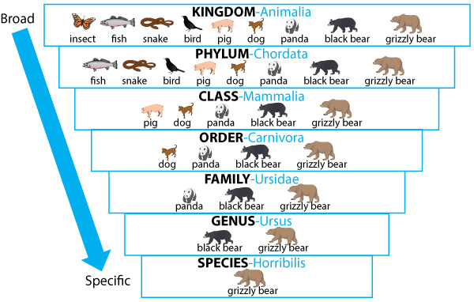
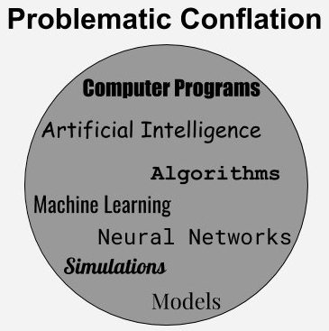
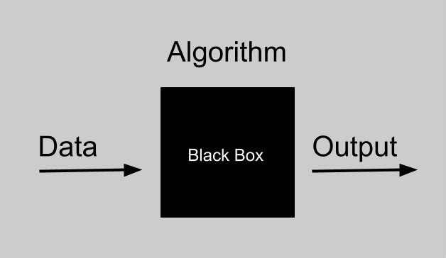

<!--  -->

# A Taxonomy of Algorithmic Rhetoric

-------------------------------------------------------------------------------

-------------------------------------------------------------------------------

#### How the machine ‘thinks’: Understanding opacity in machine learning algorithms

This article considers the issue of opacity as a problem for socially consequential mechanisms of classification and ranking, such as spam filters, credit card fraud detection, search engines, news trends, market segmentation and advertising, insurance or loan qualification, and credit scoring. These mechanisms of classification all frequently rely on computational algorithms, and in `many` cases on machine learning algorithms to do this work. In this article, I draw a distinction between three forms of opacity: (1) opacity as intentional corporate or state secrecy, (2) opacity as technical illiteracy, and (3) an opacity that arises from the characteristics of machine learning algorithms and the scale required to apply them usefully.

Jenna Burrell: [https://journals.sagepub.com/doi/abs/10.1177/2053951715622512](https://journals.sagepub.com/doi/abs/10.1177/2053951715622512)

-------------------------------------------------------------------------------

-------------------------------------------------------------------------------

